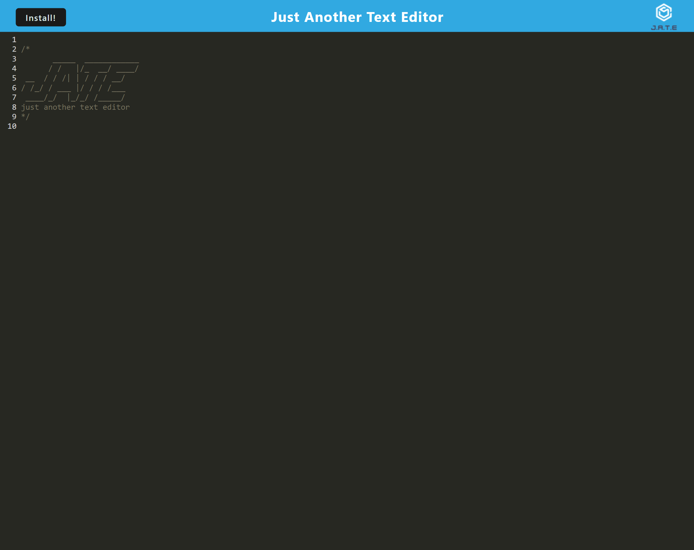
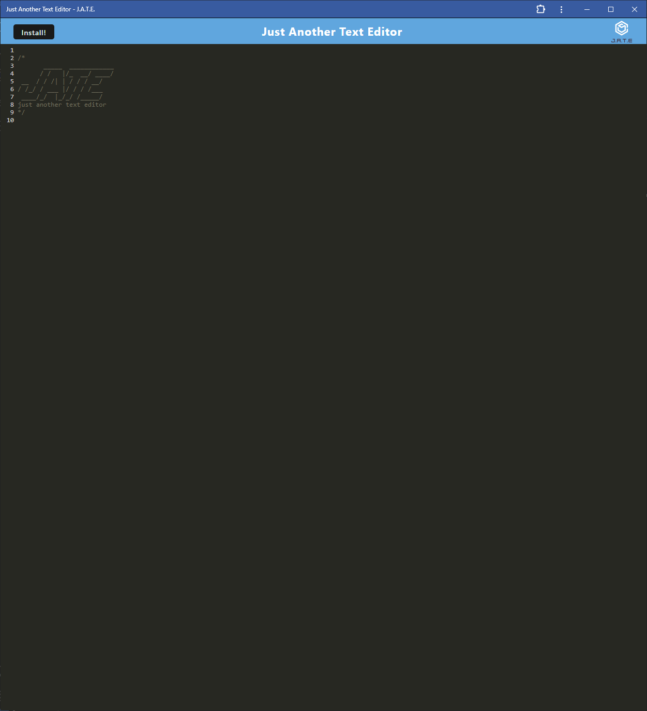

# PWA Text Editor

## Description

Git Repo: https://dnoon23.github.io/portfolio/ 

Heroku deployment: https://dnoon23-pwa-text-editor-ab67b5afd607.herokuapp.com/

This project was to create a PWA text editor that allowed the user to be able to write code whether on or offline.  

## Installation

If using the deployed site the editor can be used in the browser and can be installed by clicking the install button in the upper left of the screen.  If the repo was used, open the main directory in the repo and install the dependancies.  Then in the terminal type `npm start`.  Once it's finished building the program will be running on port 3000.  When the program is open in the browser clicking the install button in the upper left of the screen will install the PWA.

## Usage

When the program is open, click in the text field and start typing.

## Credits

Starter code was provided from my instructor. 

Other code modified from code taken from: 
https://git.bootcampcontent.com/

## Features

This program features PWA that can be run online or installed to run offline.